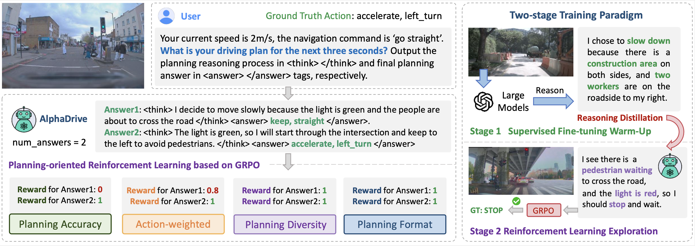
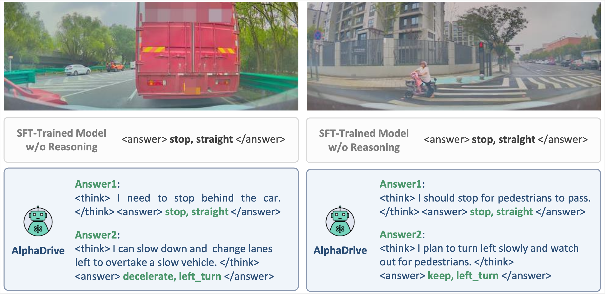

<div align ="center">

<h2>🌌 AlphaDrive: Unleashing the Power of VLMs in Autonomous

Driving via Reinforcement Learning and Reasoning</h2>

[Bo Jiang](https://scholar.google.com/citations?user=UlDxGP0AAAAJ&hl=zh-CN)<sup>1</sup>, [Shaoyu Chen](https://scholar.google.com/citations?user=PIeNN2gAAAAJ&hl=en&oi=sra)<sup>1,2</sup>, [Qian Zhang](https://scholar.google.com/citations?user=pCY-bikAAAAJ&hl=zh-CN)<sup>2</sup>, [Wenyu Liu](http://eic.hust.edu.cn/professor/liuwenyu/)<sup>1</sup>, [Xinggang Wang](https://xwcv.github.io/)<sup>1,📧</sup>

<sup>1</sup> Huazhong University of Science and Technology,
<sup>2</sup> Horizon Robotics,
<sup>📧</sup> corresponding author


[](https://arxiv.org/abs/2503.07608)
[](https://opensource.org/licenses/Apache-2.0)

</div>

<div align="center">

</div>

https://github.com/user-attachments/assets/71695178-90ca-4f5c-acc2-ab2e13c63e43


## ✨ Highlights

* To the best of our knowledge, AlphaDrive is the first to integrate GRPO-based RL with planning reasoning to autonomous driving, significantly boosting both performance and training efficiency.

* We are excited to discover that, following RL training, AlphaDrive exhibits some emergent multimodal planning capabilities, which is promising for improving driving safety and efficiency.


## 📋 News

`[2025-3-26]:` We have released the training and evaluation scripts of AlphaDrive.

`[2025-3-11]:` AlphaDrive [arXiv](https://arxiv.org/abs/2503.07608) paper released. Code are coming soon. Please stay tuned! ☕️


## 🎮 Getting Started
### Installtion
```shell
git clone git@github.com:hustvl/AlphaDrive.git
conda create -n alphadrive python=3.11 -y
conda activate alphadrive
sh setup.sh
```

### Data Preparation
We provide the [prompt templates](https://github.com/hustvl/AlphaDrive/blob/main/data_tools/prompt_hub.py) used in AlphaDrive for training and generating planning reasoning data, and an example QA is provided in [example.json](https://github.com/hustvl/AlphaDrive/blob/main/data_tools/example.json).


### Training
For Supervised Fine-tuning Phase:
```shell
sh train_tools/run_train_sft.sh
```

For Reinforcement Learning Phase:
```shell
sh train_tools/run_train_grpo.sh
```

### Evaluation
You can evaluate the meta-action planning accuracy using the script below.
```shell
sh eval_tools/qwen2vl_plan_cmd_eval.sh
```


## 📊 Qualitative Results


<div align="center">

</div>


## ❤️ Acknowledgements

This repo is built on [open-r1](https://github.com/huggingface/open-r1) and [R1-V](https://github.com/Deep-Agent/R1-V). We sincerely thank the contributors for their great work!

## 📚 Citation
If you find AlphaDrive useful in your research or applications, please consider giving us a star &#127775; and citing it by the following BibTeX entry.


```bibtex
@article{jiang2025alphadrive,
      title={AlphaDrive: Unleashing the Power of VLMs in Autonomous Driving via Reinforcement Learning and Reasoning}, 
      author={Bo Jiang and Shaoyu Chen and Qian Zhang and Wenyu Liu and Xinggang Wang},
      year={2025},
      eprint={2503.07608},
      archivePrefix={arXiv},
      primaryClass={cs.CV},
      url={https://arxiv.org/abs/2503.07608}, 
}
```

## 🥰 Related Projects
Check out our other awesome projects:

[VAD & VADv2](https://github.com/hustvl/VAD): Vectorized Scene Representation for Efficient Autonomous Driving.

[Senna](https://github.com/hustvl/Senna): Bridging Large Vision-Language Models and End-to-End Autonomous Driving.

[DiffusionDrive](https://github.com/hustvl/DiffusionDrive): Truncated Diffusion Model for End-to-End Autonomous Driving.

[RAD](https://hgao-cv.github.io/RAD/): Training an End-to-End Driving Policy via Large-Scale 3DGS-based Reinforcement Learning.

[MapTR](https://github.com/hustvl/MapTR): An End-to-End Framework for Online Vectorized HD Map Construction.
